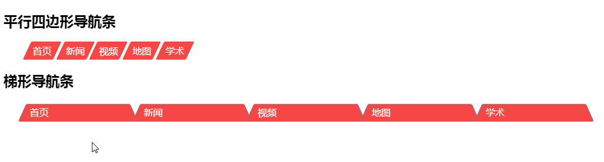

# 带有形状的导航条 :sunny::sunny::sunny:

效果图如下：
***

***

`Demo`:point_right:[演示地址](https://xm2by.github.io/css-animation/%E5%B8%A6%E6%9C%89%E5%BD%A2%E7%8A%B6%E7%9A%84%E5%AF%BC%E8%88%AA%E6%9D%A1/index.html):point_left:

>为导航条添加不同的形状后，导航条会看起来很酷:sunglasses::sunglasses::sunglasses:

### 利用纯css为导航条添加不同的形状

* 1.在制作不同形状的导航条时，一般会采用将图片背景作为导航条的形状，但是使用图片背景存在着一些缺点，如：需要额外加载背景图片，代码可重复利用性差，样式修改需要重新制作背景图片。

* 2.使用css制作不同形状的导航条主要是利用css3中3D变形，包括：```skew、perspective、rotate、transform-origin```等进行变换产生不同的形状。

* 3.为了保证在产生3D变换时，文本内容不随着变形，需要使用伪类元素(```::before,::after```)，对伪类元素进行3D变换。

* 4.对伪类元素进行绝对定位，使用```top:0; right:0; bottom:0; left:0;```使得伪类元素的宽高等于其父元素的宽高；或者使用绝对定位，```top:0; left:0; width:100%; height:100%;```使得伪类元素的宽高等于其父元素的宽高，我在这儿采取了第一种方法。

* 5.需要设置伪类元素的z-index值小于其父元素，其父元素不设置背景，这样伪类元素产生的不同形状就可以成为父元素的背景。

***

* html代码见`index.html`文件
* css代码见`css`文件
* 切换导航条用到的js代码见`index.html`文件
