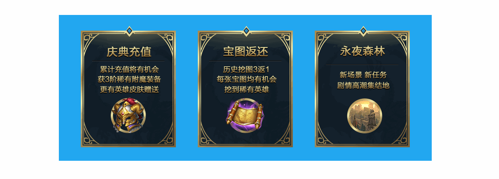

# 旋转门效果 :barber::barber::barber:

效果图如下：
***

***

`Demo`:point_right:[演示地址](https://xm2by.github.io/css-animation/%E6%97%8B%E8%BD%AC%E9%97%A8%E6%95%88%E6%9E%9C/index.html):point_left:

>旋转门效果——从字面上就很容易理解，它是实现像星级酒店大厅门口那种旋转门一样的效果，在页面中可以用来进行图片、文字等信息的展示，其正反两面都载有信息，用户可以根据个人喜好、需求来选择浏览不同的信息，让信息展示具有了交互性，令人印象深刻 :satisfied::satisfied::satisfied:

### 实现旋转门效果的关键点

>旋转门效果的关键是对正反面的内容进行3d旋转，即绕Y轴旋转。

* 1.为正反面内容的父元素`rotate-item`设置视角`perspective:1200px;`，设置视角是为了让元素能产生3d效果。

* 2.为变换元素（正反面内容）设置3d空间`transform-style:preserve-3d;`，设置3d空间是为了让元素进行3d效果展示。

* 3.使用绝对定位将正反两面元素位于同一位置，通过设置`z-index`将正面内容显示在上，利用`rotateY(-180deg)`对背面内容进行旋转。

* 4.需要为旋转元素（正反面内容）设置旋转后元素背向屏幕时为不可见，`backface-visibility:hidden;`，设置`backface-visibility`是为了让旋转到屏幕后的元素不影响屏幕前的元素。

* 5.为`rotate-item`添加`hover`效果，当鼠标`hover`到`rotate-item`元素上时，正面内容元素由`0deg`旋转到`180deg`，反面元素由`-180deg`旋转到`0deg`。

* 6.最后就是需要为`rotate-item`设置`transition:0.6s;`（过渡时间可以自行设置），这样才能看到整个旋转的过程。

***

* html代码、css代码见`index.html`文件
* 图片素材见`img`文件

>素材源自网易迷雾世界游戏，在此感谢一下网易的哥哥姐姐们！！！
