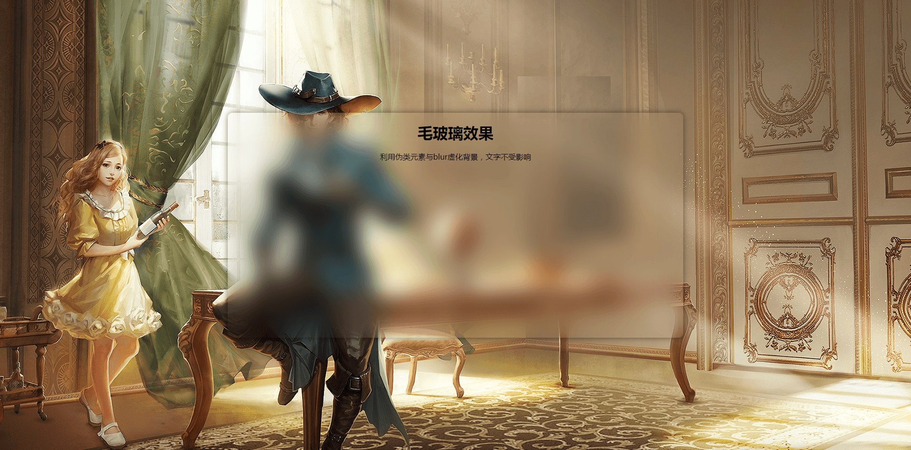

# 毛玻璃效果 :sunny::sunny::sunny:

效果图如下：
***

***

`Demo`:point_right:[演示地址]():point_left:

>为元素添加毛玻璃效果后，有文本内容的地方，其背景模糊化，文本内容不受影响，然后配合页面背景（让页面背景与文本内容背景相同），虚实相映，瞬间就看起来就高大上:sunglasses::sunglasses::sunglasses:

### 利用纯css实现毛玻璃效果

* 1.使用css实现毛玻璃效果，如果直接对文本内容元素进行模糊化处理，那么文本内容也会随之模糊化，这不是我们想要的结果。

* 2.为了只让文本内容背景模糊化，文本内容不受影响，需要使用伪类元素(```::before,::after```)，对伪类元素进行绝对定位，为其设置背景图片，设置伪类元素的z-index值小于其父元素，让父元素不设置背景图片，这样伪类元素就成为文本内容的背景。此时，对伪类元素进行模糊化处理，就可以得到毛玻璃效果。

* 3.模糊化处理需要用到css3的```filter:blur(20px);```。

* 4.为伪类元素设置背景图片时需要注意：为了让模糊化处理后的背景图片与页面背景图片能够衔接的更好，在设置伪类元素背景图片时需采用```background:url("../img/bg.png") center center no-repeat;```或者```background:url("../img/bg.png") center center no-repeat; background-size:cover; background-attachment:fixed;```方式。我在Demo中采用的是第二种。

***

* html代码见`index.html`文件
* css代码见`css`文件
* 图片素材见`img`文件

>素材源自网易大航海之路游戏，在此感谢一下网易的哥哥姐姐们！！！
